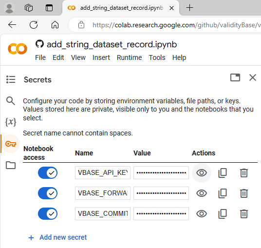

# vBase Cloud Notebooks Quickstart

The easiest way to get started with vBase is by accessing Python notebook samples using a cloud notebook service such as [Google Collab](https://colab.research.google.com/). The following steps guide you through this process:

1. **Get a vBase API key:**
    Please [contact vBase](https://www.vbase.com/contact/) and request an API key if you wish to have the simplest experience. The API key is needed to access the forwarder API service, which simplifies commitment and validation operations but is not required for interacting with vBase.

1. **Access Google Collab:**
    Access Google Collab via the following link: [https://colab.research.google.com](https://colab.research.google.com)

1. **Open the Google Collab secrets manager:**
    Access the secrets manager by clicking on the key icon in the left panel of Google Collab:

    

1. **Set up your Google Collab environment:**

   1. **Option 1: Use a Notebook to set up your vBase environment:**
    Once you have the API key, the following notebook will guide you through the steps of setting up your Google Collab environment: [https://colab.research.google.com/github/validityBase/vbase-py-samples-collab/blob/main/samples/setup.ipynb](https://colab.research.google.com/github/validityBase/vbase-py-samples-collab/blob/main/samples/setup.ipynb)

   2. **Option 2: Copy your existing vBase environment:**
    If you have previously configured vBase access, for instance, when using the `vbase-py-tools` package, you can re-use those settings from the `.env` file created during the initialization. Copy `FORWARDER_ENDPOINT_URL`, `FORWARDER_API_KEY`, and `PRIVATE_KEY` values from your `.env` file to the secrets manager.

2. **Verify your environment:**
    Below is a summary of the configuration settings.
    These are the variables that must be defined in the secrets manager:

    1. **FORWARDER_ENDPOINT_URL**
   
        This is the vBase Forwarder URL. 
        The following is the production vBase Forwarder service URL.
        Users should not change this value:

        `https://api.vbase.com/forwarder/`

    2. **FORWARDER_API_KEY**
   
        This is the API key for accessing the vBase Forwarder service.
        Users should set this value to the API key they received from vBase.

        `YOUR_VBASE_API_KEY`

    3. **PRIVATE_KEY**

        This is the private key for making stamps/commitments.
        This key signs and controls all operations for the user &mdash; it must be kept secret.
        vBase will never request this value.

        `YOUR_PRIVATE_KEY`

3. **Open notebooks in Collab:**
    Open any of the sample notebooks in Google Collab and get going!

    [https://colab.research.google.com/github/validityBase/vbase-py-samples-collab/blob/main/samples/](https://colab.research.google.com/github/validityBase/vbase-py-samples-collab/blob/main/samples/)

4. **You are all set!**
    You can make and verify commitments. Please review the samples and their documentation for additional info.
