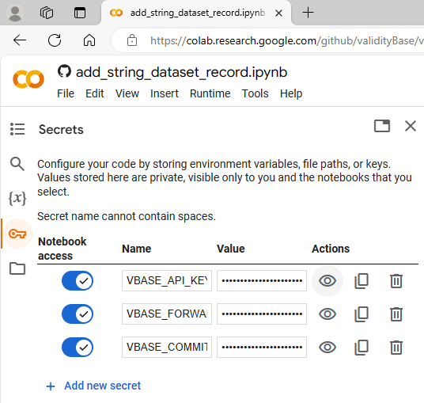

# vBase Google Colab Quickstart

The samples run in [Google Colab](https://colab.research.google.com/) and use
the `vbase-api` Python package. Basic samples require only a vBase API key.

## 1. Get a vBase API Key

1. Sign in to [vBase](https://app.vbase.com).
2. Open [Account Settings](https://app.vbase.com/profile#account_settings).
3. Copy your API key and keep it private.

## 2. Add the API Key to Google Colab

Open the [setup notebook](https://colab.research.google.com/github/validityBase/vbase-py-samples-collab/blob/main/samples/setup.ipynb),
then select the key icon in the left sidebar to open the Secrets panel.

Create a secret named `VBASE_API_KEY`, paste the API key as its value, and
enable notebook access. Do not paste the API key into a code cell or save it in
notebook output. Run the setup notebook's validation cell to confirm that vBase
accepts the key before opening another sample.

The vBase API client uses `https://app.vbase.com` by default. The samples do not
require a Forwarder URL or a blockchain private key.

## 3. Configure Amazon S3 When Needed

Only the four producer and verifier samples with `_s3` in their file names
need AWS configuration. Add these Google Colab secrets:

- `AWS_ACCESS_KEY_ID`
- `AWS_SECRET_ACCESS_KEY`
- `AWS_DEFAULT_REGION`
- `AWS_S3_BUCKET`
- `AWS_SESSION_TOKEN` when using temporary credentials

Use a dedicated AWS identity with access limited to the bucket and prefix used
by the samples. The bucket must already exist.

The producer samples write below these prefixes:

- `vbase-samples/portfolio-history/`
- `vbase-samples/sentiment-history/`

## 4. Run a Sample

Start with [Create a collection](https://colab.research.google.com/github/validityBase/vbase-py-samples-collab/blob/main/samples/create_set.ipynb)
or [Stamp a text record](https://colab.research.google.com/github/validityBase/vbase-py-samples-collab/blob/main/samples/add_string_dataset_record.ipynb).
Run cells from top to bottom.

For an S3 workflow, run a producer before its matching verification sample.
The producer prints the collection name, collection CID, owner address, and S3
location. Copy the printed CID to `COLLECTION_CID` in the matching verifier.
Verification defaults to the current vBase account; to verify data from another
producer, also set `OWNER_ADDRESS` to the address supplied by that producer.

See the [repository README](../README.md#samples) for the complete sample list.
